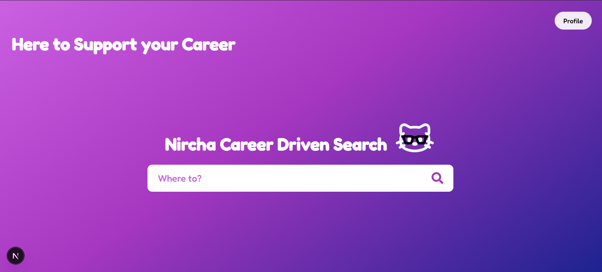
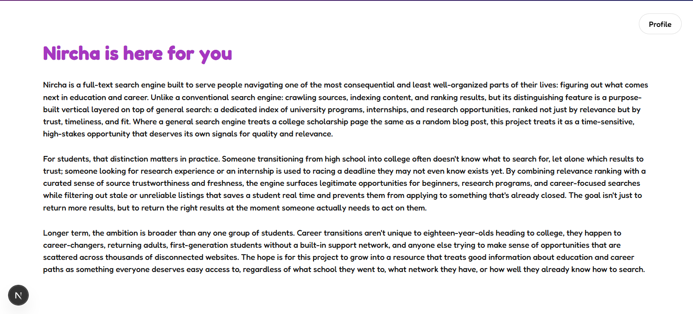
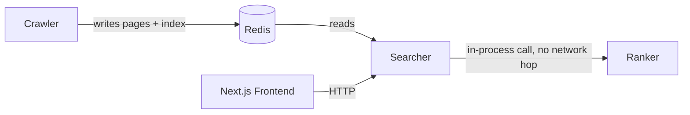

<p align="center">
  
</p>

<h3 align="center">
  Career Driven Search Engine
</h3>

<p align="center">
  
</p>

---

<StackIcon name="reactnative" />

# Nircha

<p align="center">
  
  
</p>

## Architecture

Four pieces: three are Go services sharing one Redis instance, the
fourth the Next.js frontend that communicates with the API over HTTP:



- **Crawler** fetches pages, extracts both general content and
  opportunity-specific fields (deadlines, field of study, degree level,
  location, trust tier), and writes everything to Redis.
- **Ranker** calculates the composite scoring formula 
  (text relevance, field match, trust, freshness, deadline urgency, plus
  a personalization signal for major) and the hard eligibility filter for 
  degree level/location.
- **Searcher** is the REST API: looks a query up against Redis, resolves
  full listing data, applies the hard filter, calls into `ranker` directly
  in-process for scoring, and returns JSON.
- **Frontend** is the Next.js app that calls the searcher's API and lets a
  person optionally save a profile (major, degree level, location) that
  personalizes every search afterward.

## Technology Stack

**Backend:** Go, Redis (persistence, inverted index, hybrid RDB+AOF)   
**Frontend:** Next.js (App Router), React, TypeScript  
**Build:** Docker, Git

## Project Structure

```
nircha/
│
├── search-engine/           # Go backend
│   ├── crawler/             # module search-engine/crawler
│   ├── ranker/              # module search-engine/ranker
│   ├── searcher/            # module search-engine/searcher
│   └── docker-compose.yml
└── src/                     # Next.js frontend
    ├── app/                 # pages (home, /search)
    ├── components/          # feature-organized components + types
    ├── hooks/               # useProfile (localStorage-backed)
    ├── lib/                 # typed searcher API client
    └── styles/              # CSS modules
```

## Docker

```bash
cd search-engine
docker compose up --build
```

Starts Redis, runs the crawler once, and brings up the searcher on
`:8080`. The crawler does one crawl pass and exits; it not a long-running 
service; The searcher stays running for search to work.

## Purpose

Career and education search is one of the most least well-organized 
research most people ever do if counseling guidance is not provided. 
Nircha is a search engine built to for this problem: a dedicated index 
of university programs, internships, and research opportunities, ranked 
not just by text relevance but by trust, timeliness, and personalization. 
A general search engine usually does not distinguish a real, time-sensitive 
scholarship deadline from an unrelated blog post, but here that distinction 
is the whole point.

The goal isn't more results, it's the *right* results, surfaced at the
moment someone can still act on them. Nircha is here to support the rising 
college students and those who are becoming more career oriented, or anyone 
else who needs just a nudge in the right direction in navigating opportunities 
scattered across thousands of sites without a network to guide them.

# License

Copyright (c) 2026 Kiet Tran

Nircha is licensed under the GNU General Public License v3.0 (GPLv3).

See LICENSE.md for the project license.